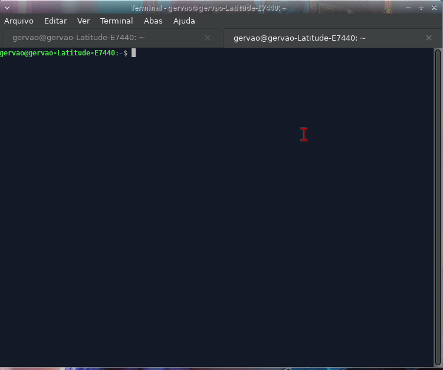

# Odysseus Search

Odysseus Search é uma ferramenta que permite buscar a presença de um usuário em diversos sites. A ferramenta gera um relatório em formato HTML com os resultados da busca, incluindo um grafo de conexões.
Distros: OdysseusOS, Kalli, Debian,Ubuntu,etc.

## Funcionalidades

- Busca a presença de um usuário em diversos sites.
- Gera um relatório em formato HTML com os resultados da busca.
- Inclui um grafo de conexões no relatório HTML.
- Gera um relatório em formato HTML

### Início da Execução



### Fim da Execução


## Pré-requisitos e dependências

- `awk`
- `pandoc`
- `toilet`
- `jq`
- `curl`

## Instalação

1. Clone o repositório:

    ```sh
    git clone https://github.com/franqlin/odysseus-search.git
    cd odyusersearch
    ```
    

2. Execute o script de instalação:

    ```sh
    chmod +x install.sh
    ./install.sh
    ```

    O script de instalação fará o seguinte:
    - Verificará e instalará as dependências necessárias.
    - Criará o diretório de instalação em [    install_dir="/opt/odyusersearch"] se ele não existir.
    - Copiará os arquivos [odyusersearch] e [sites.json] para o diretório de instalação.
    - Criará um link simbólico em [/usr/bin] para o arquivo [odyusersearch]

## Uso

Para usar a ferramenta, execute o comando [odyusersearch] seguido do nome de usuário que você deseja pesquisar:

```sh
odyusersearch <usuario>